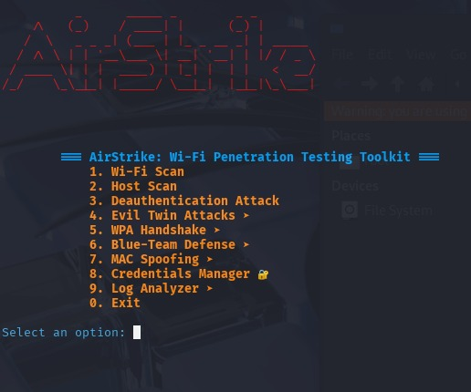

# 🚀 AirStrike - Modular Wi-Fi Security Framework

**AirStrike** is a Python-based, modular toolkit for conducting both offensive (Red Team) and defensive (Blue Team) operations in wireless networks. Built for penetration testers, security researchers, and students, it brings together powerful tools for Wi-Fi reconnaissance, attacks, threat detection, credential management, and log analysis — all within a clean command-line interface.

---

## 🧩 Features

### 🔴 Red Team Capabilities
- **Wi-Fi Scanning** – Discover nearby access points and clients
- **Deauthentication Attacks** – Disconnect clients to capture WPA handshakes
- **Evil Twin Attacks** – Clone networks and capture credentials via a fake AP
- **WPA Handshake Capture & Cracking** – Capture `.cap` files and perform dictionary-based offline attacks
- **MAC Address Spoofing** – Anonymize or randomize MAC addresses during attacks

### 🔵 Blue Team Capabilities
- **Live Threat Detection** – Monitor for rogue APs, spoofed MACs, and deauth attempts
- **Log Analysis Tool** – Classify historical log severity, generate reports with remediation steps
- **Credential Vault** – Secure storage of captured or tested credentials using AES encryption

---

## 🖼️ Screenshots



---

## ⚙️ Installation

### 1. Clone the Repository
```bash
git clone https://github.com/yourusername/AirStrike-NG.git
cd AirStrike-NG
